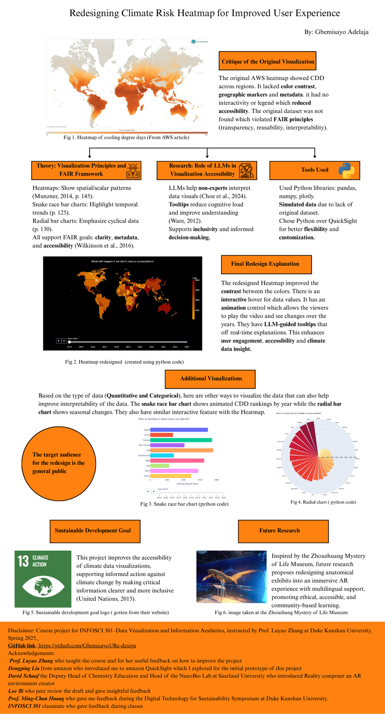

# Redesigning the AWS Heatmap: Visualizing Cooling Degree Days (CDD)

This project is a redesign of the original AWS Cooling Degree Days (CDD) heatmap. The goal was to enhance interpretability, interactivity, and accessibility through thoughtful visualization, guided by data visualization theory and FAIR principles.

---

## Table of Contents

- [Overview](#overview)
- [Visualizations Included](#visualizations-included)
- [Tools & Libraries](#tools--libraries)
- [Theory & Frameworks](#theory--frameworks)
- [Navigation Instructions](#navigation-instructions)
- [Sustainable Development Goal](#sustainable-development-goal)
- [Future Research](#future-research)
- [Project Information](#project-information)
- [Acknowledgement](#acknowledgement)
- [References](#references)

---

## Overview

The original AWS heatmap lacked contrast, context, and metadata transparency. This project presents an improved visualization suite using Python to communicate Cooling Degree Days data more effectively through three distinct charts.

---

## Visualizations Included

1. **Heatmap** – Improved contrast and interactivity, spatial-temporal CDD overview  
2. **Snake Race Bar Chart** – Animated chart visualizing annual trends and rankings  
3. **Radial Bar Chart** – Emphasizes the cyclical, seasonal nature of CDD data  

All charts support:
- **Hover-based interaction** for tooltip insights  
- **Playback controls** for animated transitions through years  

---

## Tools & Libraries

- `pandas` – Data handling  
- `numpy` – Data simulation (original dataset unavailable)  
- `plotly` – Interactive and animated data visualizations  

---

## Theory & Frameworks

- **Visualization Theory**
  - Heatmaps: spatial + scalar encoding (Munzner, 2014, p.145)  
  - Snake bar charts: ranking + time (Munzner, 2014, p.125)  
  - Radial charts: seasonal patterns (Munzner, 2014, p.130)  
- **FAIR Principles** (Wilkinson et al., 2016):  
  - *Findable, Accessible, Interoperable, Reusable*  
- **LLM Accessibility Research** (Choe et al., 2024):  
  - Integrating large language models enhances accessibility and understanding for non-expert users.

---

## Navigation Instructions

- **`301_Gbemisayo_Adelaja_report_final.pdf`** – Full written explanation of critique, theory, redesign and research  
- **`Infovis redesign updated.ipynb`** – Open in Jupyter or Colab to view/edit the Python visualizations  
- **`cooling_degree_days_2014_2024.xlsx`** – Data file used in the redesign  
- **`301_Gbemisayo_Adelaja_poster_final.pdf`** – Summary poster suitable for presentation with all visualizations included  

---
## Sustainable development goal 

- SDG 13: Climate action. This project improves the accessibility of climate data visualizations, supporting informed action against climate change by making critical information clearer and more inclusive (United Nations, 2015).

---
## Future Research  

- Inspired by the Zhouzhuang Mystery of Life Museum, future research proposes redesigning anatomical exhibits into an immersive AR experience with multilingual support, promoting ethical, accessible, and community-based learning.

---
## Project Information

- **Author**: Gbemisayo Motunrayo Aderonke Adelaja 
- **Instructor**: Professor Luyao Zhang 
- **Course**: INFOSCI 301- Data visualization and Asethetics 
- **Institution**: Duke Kunshan University
- **Acknowledgement**: Thanks to the instructors and peers who provided feedback throughout the project.

**Disclaimer**: This project was created for academic purposes. The dataset used is simulated and does not represent actual climate data from AWS.

---
## Acknowlegement 

- Prof. Luyao Zhang who taught the course and for her useful feedback on how to improve the project  
- Dongping Liu from amazon who introduced me to amazon QuickSight which I explored for the initial prototype of this project
- David Schaaf  the Deputy Head of Chemistry Education and Head of the NanoBio Lab at Saarland University who introduced Reality composer an AR environment creator 
- Loe Bi who peer review the draft and gave insightful feedback 
- Prof. Ming-Chun Huang who gave me feedback during the Digital Technology for Sustainability Symposium at Duke Kunshan University.
- INFOSCI 301 classmate who gave feedback during classes 

---
## References

- Choe, G., Ragan, E., & Stasko, J. (2024). *LLMs for Visualization Accessibility*.  
- Munzner, T. (2014). *Visualization Analysis and Design*. CRC Press.  
- Ware, C. (2012). *Information Visualization: Perception for Design*. Morgan Kaufmann.  
- Wilkinson, M. D., et al. (2016). *The FAIR Guiding Principles*. Scientific Data.  
- AWS (2024), Gartner (2024), Yurbi (2023), Transcenda (2022)

---

## Project Poster

